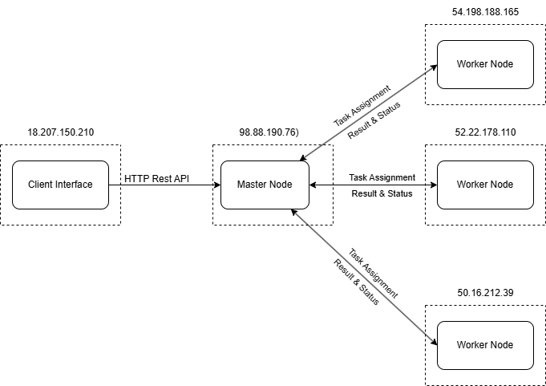

# GridMR - Distributed MapReduce System

## 1. Course Info

<table>
    <tbody>
        <tr>
            <td>Course code</td>
            <td>ST0263</td>
        </tr>
        <tr>
            <td>Course name</td>
            <td>Distributed Systems</td>
        </tr>
        <tr>
            <td>Students</td>
            <td>
                <ol>
                <li>Jerónimo Acosta Acevedo(<tt>jacostaa1[at]eafit.edu.co</tt>)</li>
                <li>Juan José Restrepo Higuita (<tt>jjrestre10[at]eafit.edu.co</tt>)</li>
                <li>Luis Miguel Torres Villegas (<tt>lmtorresv[at]eafit.edu.co</tt>)</li>
                </ol>
            </td>
        </tr>
        <tr>
            <td>Professor</td>
            <td><a href="https://scholar.google.com/citations?user=BhCMq0oAAAAJ&hl=es">Edwin Nelson Montoya Múnera</a> (<tt>emontoya[at]eafit.edu.co</tt>)
        </tr>
    </tbody>
</table>

## 2. Description

GridMR is a distributed MapReduce system implementation based on the original Hadoop MapReduce architecture. Unlike traditional cluster-based deployments, this system is designed to run across a grid of internet-connected machines, making it suitable for distributed computing across heterogeneous environments.

The system implements the complete MapReduce paradigm with:
- **Master Node**: Orchestrates job execution, manages workers, and coordinates the MapReduce workflow
- **Worker Nodes**: Execute map and reduce tasks on distributed data
- **Client Interface**: Submits jobs and retrieves results
- **Fault Tolerance**: Handles worker failures and task retries
- **RESTful API**: HTTP-based communication between all components

## 3. Requirements

### 3.1. Completed Features

✅ **Core MapReduce Framework**
- Map and Reduce phase orchestration
- Task distribution and scheduling
- Intermediate data handling and partitioning
- Job lifecycle management (submit, monitor, cancel, retrieve results)

✅ **Distributed Architecture**
- Master-worker architecture with REST API communication
- Worker registration and heartbeat monitoring
- Dynamic task assignment to available workers
- Fault detection and handling

✅ **Job Management**
- Job submission with data and code URLs
- Real-time job status monitoring with progress tracking
- Result collection and aggregation
- Support for multiple concurrent jobs

✅ **Example Implementations**
- Word Count MapReduce job
- Character Count job
- Line Length analysis job

✅ **Testing and Documentation**
- Comprehensive test suite
- CLI interface for all components
- Detailed usage examples

### 3.2. Planned Enhancements

🔄 **Advanced Features**
- Dynamic code loading from remote URLs
- Enhanced fault tolerance with task retries
- Load balancing across heterogeneous workers
- Support for more complex data types
- Job dependency management

## 4. Architecture

### 4.1. System Overview



### 4.2. Component Responsibilities

**Master Node**:
- Receives job submissions from clients
- Manages worker registration and health monitoring
- Splits input data into tasks for the map phase
- Coordinates map and reduce task execution
- Aggregates results and provides job status updates

**Worker Nodes**:
- Register with master on startup
- Execute assigned map/reduce tasks
- Send periodic heartbeats to master
- Handle task failures and report status

**Client**:
- Submits MapReduce jobs with data and code references
- Monitors job progress
- Retrieves final results

### 4.3. MapReduce Workflow

1. **Job Submission**: Client submits job with input data location and MapReduce code
2. **Input Splitting**: Master divides input files into map tasks
3. **Map Phase**: Workers execute map tasks, producing intermediate key-value pairs
4. **Shuffle & Sort**: Intermediate data is partitioned by key hash
5. **Reduce Phase**: Workers execute reduce tasks on partitioned data
6. **Output Collection**: Final results are written to output files
7. **Result Retrieval**: Client can download completed results

## 5. Development Environment

### 5.1. Programming Languages and Frameworks

- **Python 3.11+**: Core implementation language
- **FastAPI**: REST API framework for all HTTP endpoints
- **Uvicorn**: ASGI server for running FastAPI applications
- **Pydantic**: Data validation and serialization
- **Requests**: HTTP client for inter-node communication

### 5.2. Dependencies

Install dependencies using pip:

```bash
pip install -r requirements/run.txt
```

**Core Dependencies**:
```
fastapi>=0.100.0
uvicorn[standard]>=0.23.0
pydantic>=2.0.0
requests>=2.31.0
```

**Development Dependencies** (optional):
```bash
pip install -r requirements/dev.txt
```

## 6. Installation and Setup

### 6.1. Quick Start

1. **Clone the repository**:
```bash
git clone <repository-url>
cd gridmr
```

2. **Install dependencies**:
```bash
pip install -r requirements/run.txt
```

3. **Run the automated test**:
```bash
python test_system.py
```

This will automatically start a master node, two worker nodes, submit a word count job, and display the results.

### 6.2. Manual Setup

#### Start Master Node
```bash
python cli.py master --port 8000
```

#### Start Worker Nodes
In separate terminals:
```bash
python cli.py worker localhost 8000 --port 8001
python cli.py worker localhost 8000 --port 8002
```

#### Submit a Job
```bash
python cli.py client localhost file:///path/to/input/data wordcount
```

## 7. Usage Guide

### 7.1. Command Line Interface

The system provides a unified CLI with three modes:

```bash
python cli.py {master|worker|client} [options]
```

#### Master Mode
```bash
python cli.py master [--port PORT]
```
- `--port`: Port for master API server (default: 8000)

#### Worker Mode
```bash
python cli.py worker MASTER_IP MASTER_PORT [--port PORT]
```
- `MASTER_IP`: IP address of the master node
- `MASTER_PORT`: Port of the master node
- `--port`: Port for worker API server (default: 8001)

#### Client Mode
```bash
python cli.py client MASTER_IP DATA_URL CODE_URL
```
- `MASTER_IP`: IP address of the master node
- `DATA_URL`: URL to input data (e.g., `file:///path/to/data`)
- `CODE_URL`: MapReduce job type (e.g., `wordcount`, `charcount`, `linelength`)

### 7.2. Available MapReduce Jobs

#### Word Count
```bash
python cli.py client localhost file:///path/to/text/files wordcount
```
Counts occurrences of each word in the input text files.

#### Character Count
```bash
python cli.py client localhost file:///path/to/text/files charcount
```
Counts occurrences of each alphabetic character.

#### Line Length Analysis
```bash
python cli.py client localhost file:///path/to/text/files linelength
```
Calculates the average line length across all input files.

### 7.3. API Endpoints

The master node exposes the following REST API endpoints:

#### Job Management
- `POST /job/submit` - Submit a new MapReduce job
- `GET /job/status/{job_id}` - Get job status and progress
- `GET /job/result/{job_id}` - Get job results
- `POST /job/cancel/{job_id}` - Cancel a running job

#### Worker Management
- `POST /worker/register` - Register a new worker
- `POST /worker/heartbeat` - Worker heartbeat endpoint

#### Health Check
- `GET /` - System health check

### 7.4. Testing

#### Automated Testing
Run the comprehensive test suite:
```bash
python test_system.py [--job-type {wordcount|charcount|linelength}]
```

#### Manual Testing
1. Start components manually (see Manual Setup)
2. Create test data files in `test_folder/`
3. Submit jobs using the client CLI
4. Monitor progress via API or CLI

## 8. Example Scenarios

### 8.1. Local Development Testing

```bash
# Terminal 1: Start master
python cli.py master

# Terminal 2: Start worker 1
python cli.py worker localhost 8000 --port 8001

# Terminal 3: Start worker 2
python cli.py worker localhost 8000 --port 8002

# Terminal 4: Submit job
python cli.py client localhost file://$(pwd)/test_folder wordcount
```

### 8.2. Distributed Grid Setup

For deploying across multiple machines:

```bash
# On master machine (e.g., 192.168.1.100)
python cli.py master --port 8000

# On worker machine 1 (e.g., 192.168.1.101)
python cli.py worker 192.168.1.100 8000 --port 8001

# On worker machine 2 (e.g., 192.168.1.102)
python cli.py worker 192.168.1.100 8000 --port 8001

# From client machine
python cli.py client 192.168.1.100 file:///shared/data/input wordcount
```

### 8.3. Monitoring Job Progress

```bash
# Check job status
curl http://localhost:8000/job/status/{job_id}

# Get job results
curl http://localhost:8000/job/result/{job_id}

# Cancel job
curl -X POST http://localhost:8000/job/cancel/{job_id}
```

## 9. Implementation Details

### 9.1. Data Flow

1. **Input Processing**: Master splits input files into map tasks
2. **Map Execution**: Workers read input splits and apply map function
3. **Intermediate Storage**: Map outputs are partitioned and stored locally
4. **Reduce Execution**: Workers process partitioned intermediate data
5. **Output Generation**: Reduce results are written to final output files

### 9.2. Fault Tolerance

- **Worker Health Monitoring**: Heartbeat mechanism detects failed workers
- **Task Reassignment**: Failed tasks are automatically reassigned to healthy workers
- **Timeout Handling**: Tasks that exceed time limits are retried
- **Graceful Degradation**: System continues operating with reduced worker capacity

### 9.3. Performance Considerations

- **Parallel Execution**: Multiple map and reduce tasks run concurrently
- **Data Locality**: Tasks are assigned to minimize data transfer
- **Memory Management**: Intermediate data is streamed to prevent memory overflow
- **Network Optimization**: Efficient serialization and compression

### 9.4 Benefits of NFS Approach
- **No Network Transfers**: Workers access data directly from shared storage
- **Consistent Paths**: All nodes see identical directory structure
- **Fault Tolerance**: Data persists even if individual nodes fail
- **Simplified Coordination**: Master doesn't need to collect files over HTTP
- **Scalable**: Easy to add more workers without data distribution complexity

## 10. Extending the System

### 10.1. Adding New MapReduce Jobs

Create new mapper and reducer classes:

```python
from mapreduce import Mapper, Reducer
from mapreduce.types import KeyValue

class CustomMapper(Mapper):
    def map(self, key, value):
        # Your map logic here
        yield KeyValue(key=processed_key, value=processed_value)

class CustomReducer(Reducer):
    def reduce(self, key, values):
        # Your reduce logic here
        result = process_values(values)
        yield KeyValue(key=key, value=result)
```

Register in `examples/mapreduce_jobs.py`:
```python
MAPPER_REGISTRY["custom"] = CustomMapper
REDUCER_REGISTRY["custom"] = CustomReducer
```

### 10.2. Enhancing Worker Capabilities

Workers can be extended with:
- Specialized hardware support (GPU, TPU)
- Custom data format handlers
- Enhanced caching mechanisms
- Resource monitoring and reporting

## 11. Troubleshooting

### 11.1. Common Issues

**Workers not registering with master**:
- Check network connectivity between worker and master
- Verify master IP and port are correct
- Ensure master is running and accessible

**Jobs failing or hanging**:
- Check worker logs for error messages
- Verify input data is accessible from worker nodes
- Ensure sufficient resources (memory, disk space)

**Performance issues**:
- Increase number of worker nodes
- Optimize map/reduce functions
- Adjust task parallelism settings

### 11.2. Debugging

Enable verbose logging:
```bash
# Set log level for detailed output
export PYTHONPATH=/path/to/gridmr
python -m uvicorn master.main:app --log-level debug
```

Check worker status:
```bash
curl http://worker-ip:worker-port/health
```

## 12. References

- [Original MapReduce Paper (Google, 2004)](https://research.google.com/archive/mapreduce.html)
- [Hadoop MapReduce Tutorial](https://hadoop.apache.org/docs/r1.2.1/mapred_tutorial.html)
- [FastAPI Documentation](https://fastapi.tiangolo.com/)
- [Distributed Systems Principles and Paradigms](https://www.distributed-systems.net/)
